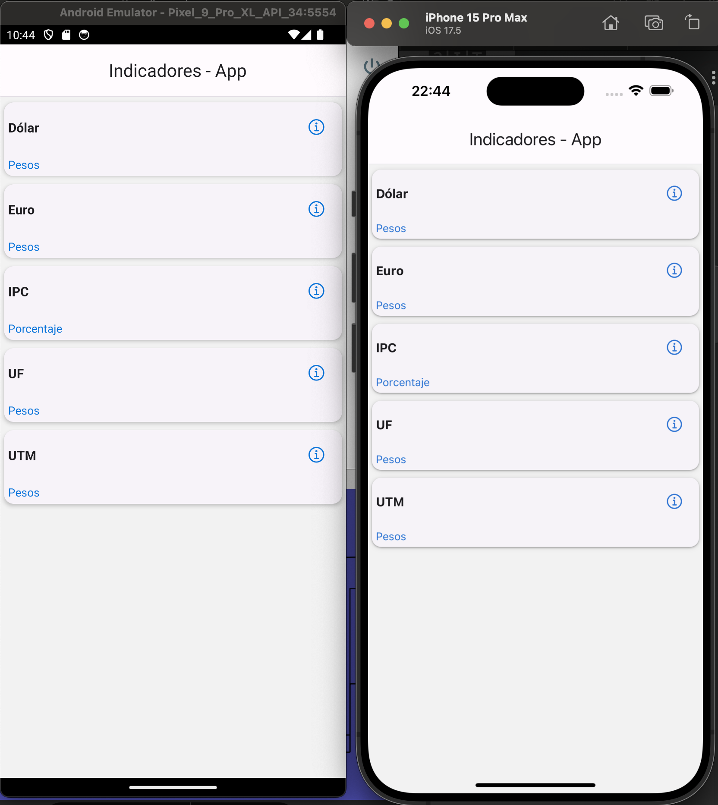
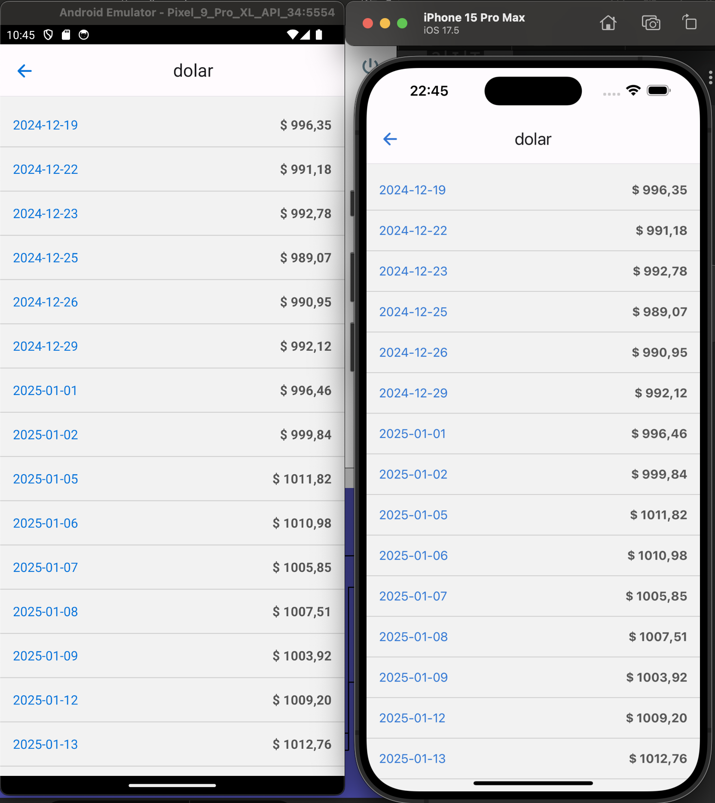
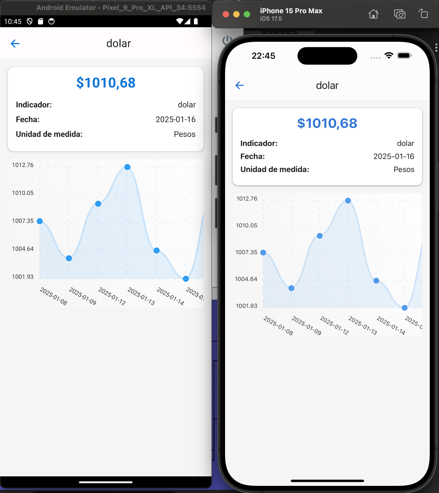

# **3IT Prueba Técnica | React Native Indicadores App**

Esta aplicación es un ejemplo de uso de **React Native** con integración a la API de **CMF Bancos**. La cual permite visualizar el detalle de los datos actuales e históricos de cada indicador financiero.

## **Configuración Inicial**

### 1. **Renombrar archivo `.env.template` a `.env`:**  
   En la raíz del proyecto, renombra el archivo `.env.template` a `.env` y asegúrate de que la variable `API_URL` y `API_KEY` esté configurada correctamente:

   Ejemplo:

   ```plaintext
   API_URL=https://api.cmfchile.cl/api-sbifv3/recursos_api
   API_KEY=123456
   ```

   

### 2. **Instalar dependencias:**  
   Ejecuta el siguiente comando en la raíz del proyecto para instalar las dependencias de **Node.js**:

   ```bash
   npm install
   ```

### 3. **Instalar dependencias de iOS (si trabajas en iOS):**  
   Si estás trabajando con **iOS**, navega a la carpeta `ios` y ejecuta el siguiente comando para instalar las dependencias de **CocoaPods**:

   ```bash
   cd ios
   pod install
   cd ..
   ```

### 4. **Ejecutar la aplicación:**  
   Inicia el servidor de desarrollo y los simuladores ejecutando:

   ```bash
   npm start
   ```

### **Descripción de la aplicación:**

1. **Pantalla principal:**  
   Listado de indicadores que devuelve la API. Este listado es estático y muestra las siguientes opciones:  
   - Dólar  
   - Euro  
   - IPC  
   - UF  
   - UTM  

   

2. **Pantalla de detalle de valores:**  
   Muestra los datos de los últimos 30 días para Dólar, Euro y UF, y del año actual para IPC y UTM al seleccionar un indicador de la pantalla principal.

   

3. **Pantalla de detalle de un indicador en particular:**  
   Muestra el detalle del valor más actual para cada indicador. Ademas muestra un Gráfico con los valores de los últimos 10 días para Dólar, Euro y UF, y de los últimos 12 meses para IPC y UTM. También muestra el valor más actual del indicador.

   

### **Librerías utilizadas:**

- **dotenv:** Manejo de variables de entorno de manera segura.  
- **react-native-paper:** Implementación de Material Design para componentes visuales.  
- **react-navigation:** Navegación entre pantallas dentro de la aplicación.  
- **react-native-chart-kit:** Biblioteca para crear gráficos en aplicaciones React Native.  
- **react-native-vector-icons:** Conjunto de iconos personalizables para React Native.  
- **axios:** Cliente HTTP para realizar solicitudes a la API.  

### **Hooks utilizados:**

- **useState**
- **useEffect**
- **useRef**

### **Custom Hooks utilizados:**

- **useAnimation**
- **useIndicator**